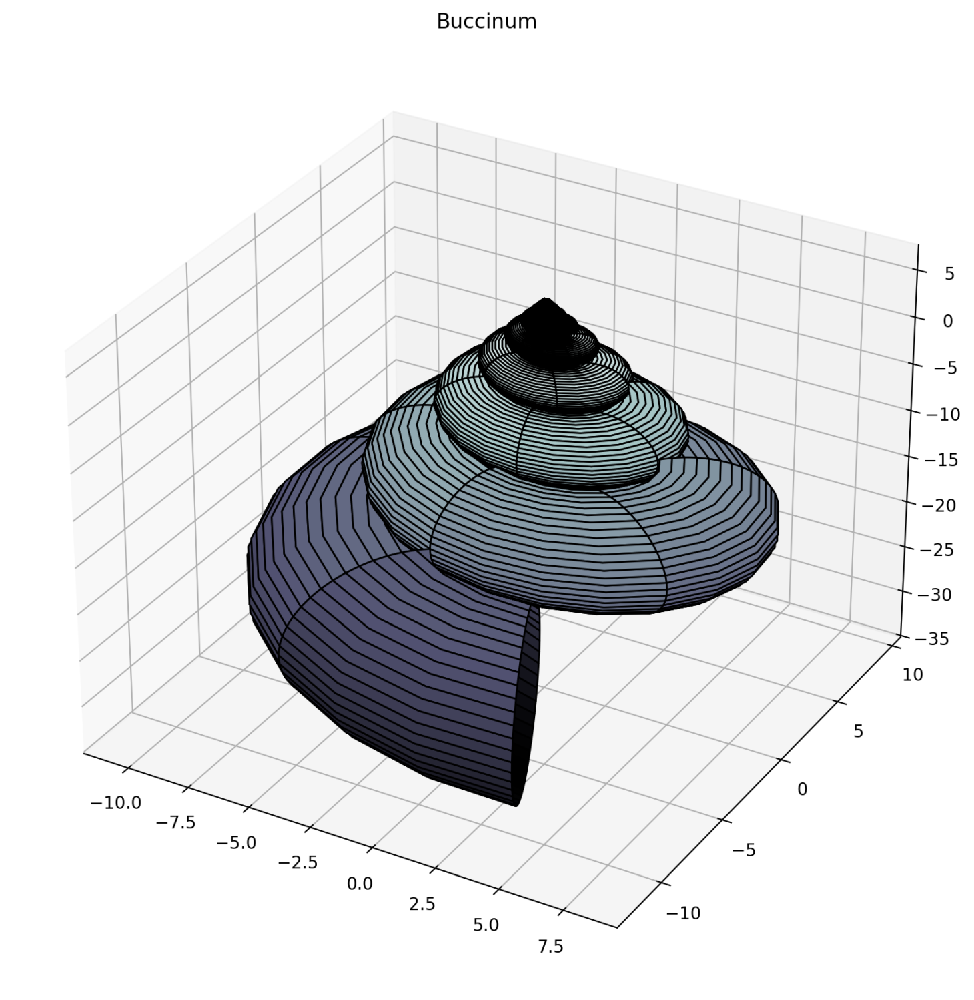

# Parametric-Equations-Shells-Modeling

This project models the geometry of different types of Mollusk shells using parametric equations. It allows users to adjust parameters dynamically and explore the mathematical principles behind natural shell shapes.

## Background

Shells found in nature, such as those from mollusks, exhibit fascinating geometric patterns. These patterns can be represented mathematically using parametric equations. This project uses parametric equations to model and visualize the 3D structure of various shell types. By adjusting parameters such as radius, amplitude, and growth factor, we can reproduce the intricate designs of these natural mollusk shells.

## Shell Types

Below is a grid showing visualizations of shell types included in this project:

<table>
  <tr>
    <td></td>
    <td></td>
    <td></td>
  </tr>
  <tr>
    <td></td>
    <td></td>
    <td></td>
  </tr>
  <tr>

    <td></td>
    <td></td>
    <td></td>
  </tr>
</table>
